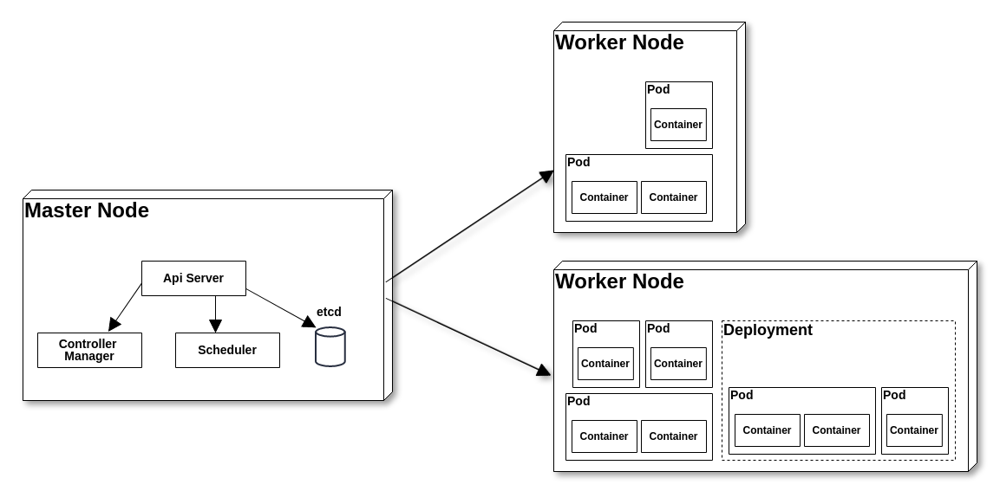

# kubernetes

`minikube` é o Kubernetes local, com foco em facilitar o aprendizado e o desenvolvimento para o Kubernetes.

Para instalar a ultima versão no linux x86-64 No seu terminal digite os seguintes comandos.

```
curl -LO https://storage.googleapis.com/minikube/releases/latest/minikube-linux-amd64
sudo install minikube-linux-amd64 /usr/local/bin/minikube
```

Uma vez que o Minikube estiver instalado, rode o seguinte comando:

```
minikube start
```
Uma máquina virtual será iniciada e o cluster Kubernetes estará disponível. Rodando comando `minikube ip ` você consegue visualizar o IP dessa máquina.

Como é possível termos acessos a diversos clusters, é necessário configurar o comando kubectl para que ele interaja especificamente com o cluster instalado pelo Minikube. Para isso execute o seguinte comando:

```
kubectl config use-context minikube
```
Assim você já pode interagir com o cluster. Se executar o comando kubectl cluster-info você verá algumas informações sobre o cluster. O comando kubectl get nodes mostrará todos os nodes disponíveis.

### Overview do Kubernetes



Nó no Kubernetes (também conhecido como worker node) é o local onde as aplicações rodam. Na imagem acima vemos diversos Pods, que são a menor unidade no Kubernetes. Esses Pods podem conter um ou mais contêineres Docker. Apesar de podermos criar diretamente os Pods, é comum usarmos Deployments pra isso, pois simplificam escalar aplicações se baseando em um template de Pod (veremos isso mais à frente).

O master node é responsável por fazer todo o trabalho pesado do Kubernetes. Ele tem basicamente quatro componentes. O Api Server, Controller Manager, Scheduler e etcd.

**Api Server** é o componente central de toda comunicação no cluster. É com ele que falamos quando executamos o comando `kubectl` por exemplo.

**Controller Manager** é responsável, entre outras coisas, por garantir que o estado informado nos arquivos yaml estejam vigentes.

**Scheduler** é quem decide onde (em qual nó) um Pod irá rodar.

**etcd** é a camada de persistência onde o Kubernetes mantém todos os dados necessários pro cluster.

### Agora crie seu primeiro arquivo de configuração do Kubernetes chamado pod.yaml (***esse arquivo pode ter qualquer nome***):

```
apiVersion: v1
kind: Pod
metadata:
  name: dummy-logger
spec:
  containers:
  - name: logger-container
    image: willallves/dummy-logger:1.0

```
Essa imagem `image: willallves/dummy-logger:1.0` deve existir no seu docker hub

Execute o comando
```
kubectl create -f pod.yaml
```
ou
```
kubectl apply -f pod.yaml
```

Há uma diferença entre os comandos `kubectl create` E `kubectl apply`.

1) O comando `kubectl create` Cria um novo recurso. Portanto, se o comando for executado novamente, ocorrerá um erro, pois os nomes dos recursos devem ser exclusivos em um espaço para nome.
```
kubectl get pods
No resources found.

kubectl create -f pod.xml 
pod/myapp-pod created

kubectl create -f pod.xml 
Error from server (AlreadyExists): error when creating "pod.xml": pods "myapp-pod" already exists
```
2) O comando `kubectl apply` Aplica a configuração a um recurso. Se o recurso não estiver lá, ele será criado. O comando `kubectl apply` Pode ser executado pela segunda vez, pois simplesmente aplica a configuração, como mostrado abaixo. Nesse caso, a configuração não mudou. Então, o pod não mudou.
```
kubectl delete pod/myapp-pod
pod "myapp-pod" deleted

kubectl apply -f pod.xml 
pod/myapp-pod created

kubectl apply -f pod.xml 
pod/myapp-pod unchanged
```
No `kubectl create`, Especificamos uma determinada ação, neste caso create e, portanto, é imperativo. No comando `kubectl apply`, Especificamos o estado de destino do sistema e não especificamos uma determinada ação e, portanto, declarativa. Deixamos o sistema decidir qual ação tomar. Se o recurso não estiver lá, ele será criado, se o recurso estiver lá, aplicará a configuração ao recurso existente.

Do ponto de vista da execução, não há diferença quando um recurso é criado pela primeira vez entre `kubectl create` e `kubectl apply` Conforme mostrado acima. Mas, na segunda vez, o `kubectl create` gerará um erro.
